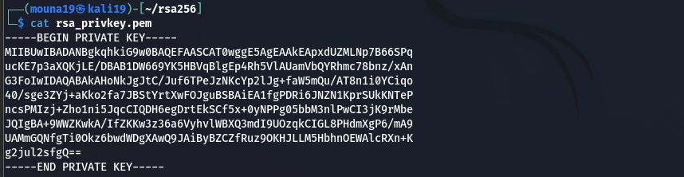
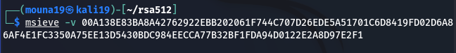
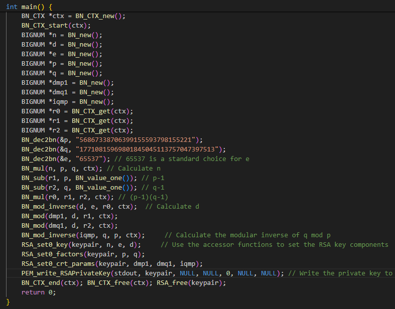
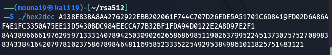
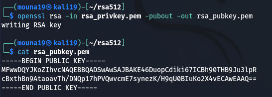
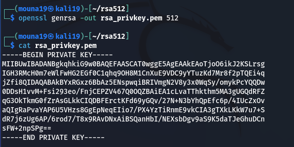
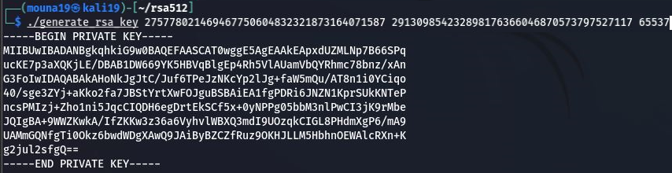
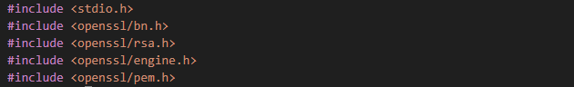
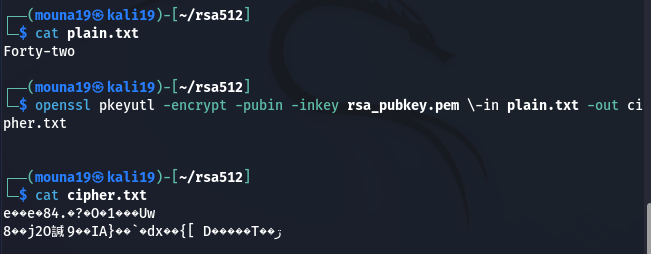

# Introduction 

In this lab, we will explore the process of breaking an RSA private key through factorization.The lab is designed to demonstrate the vulnerability of RSA keys to factorization attacks, particularly when key lengths are insufficiently large. By utilizing tools such as OpenSSL for key generation and encryption, and MSIEVE for factorizing the RSA modulus, we aim to recover the private key from the public key and other RSA parameters.

## Generating pair of keys
- Generating pair of keys : we try to generate a 256-bit RSA Key Pair
- We couldn't generate a 256-bit RSA key due to the fact that modern versions of OpenSSL and the RSA algorithm itself have deprecated or removed support for RSA keys smaller than 512 bits.So instead we generate a 512-bit Key Pair

  

  
  
- Then, we save the public key in a file 
  

- Now we can encrypt the message contained in plain.txt using the command
  ```bash
  openssl pkeyutl -encrypt -pubin -inkey rsa_pubkey.pem \-in plain.txt -out cipher.txt
  ```
  

- We can then decrypt the message as follows
  

## Cracking the private key using the public key : 

- First we use the following command to get the modulus : 
  
  
- Then, we will turn the hexadecimal number into a decimal one
  
- Now we use msieve to obtain the factorization of the modulus
  

## Getting the private key 

- We first create a file named generate_rsa_key.c : 
  ```bash
  #include <stdio.h>
  #include <openssl/bn.h>
  #include <openssl/rsa.h>
  #include <openssl/engine.h>
  #include <openssl/pem.h>
  int main() {
  RSA *keypair = RSA_new();
  BN_CTX *ctx = BN_CTX_new();
  BN_CTX_start(ctx);
  BIGNUM *n = BN_new();
  BIGNUM *d = BN_new();
  BIGNUM *e = BN_new();
  BIGNUM *p = BN_new();
  BIGNUM *q = BN_new();
  BIGNUM *dmp1 = BN_new();
  BIGNUM *dmq1 = BN_new();
  BIGNUM *iqmp = BN_new();
  BIGNUM *r0 = BN_CTX_get(ctx);
  BIGNUM *r1 = BN_CTX_get(ctx);
  BIGNUM *r2 = BN_CTX_get(ctx);
  3
  Cybersecurity - 2CSSIQ1 Moukebel Nesrine, Bouanani Oumnia
  // Définir vos facteurs p et q (ce sont les plus grands facteurs trouvés)
  BN_dec2bn(&p, "56867338706399155593798155221");
  BN_dec2bn(&q, "17710815969801845045113757047397513");
  // Définir l'exposant public e
  BN_dec2bn(&e, "65537"); // 65537 est un choix standard pour e
  // Calculer n
  BN_mul(n, p, q, ctx);
  // Calculer d
  BN_sub(r1, p, BN_value_one()); // p-1
  BN_sub(r2, q, BN_value_one()); // q-1
  BN_mul(r0, r1, r2, ctx); // (p-1)(q-1)
  BN_mod_inverse(d, e, r0, ctx); // d
  BN_mod(dmp1, d, r1, ctx);
  BN_mod(dmq1, d, r2, ctx);
  // Calculer le module p inverse de q
  BN_mod_inverse(iqmp, q, p, ctx);
  // Utiliser les fonctions d'accès pour définir les composants de la clé RSA
  RSA_set0_key(keypair, n, e, d);
  RSA_set0_factors(keypair, p, q);
  RSA_set0_crt_params(keypair, dmp1, dmq1, iqmp);
  PEM_write_RSAPrivateKey(stdout, keypair, NULL, NULL, 0, NULL, NULL);
  BN_CTX_end(ctx);
  BN_CTX_free(ctx);
  RSA_free(keypair);
  return 0}
  ```
- By executing the C program, here is the result : 
  
- We can see that the generated private key is the same as the original one. 
  
  

## Decrypting the message using the hacked private key:

- The message has been successfully decrypted ! 
  


# Conclusion
This lab demonstrated the risks associated with using small-sized RSA keys and highlighted the critical importance of utilizing sufficiently large keys to secure cryptographic systems. The experience reinforces the necessity of adopting RSA keys of at least 2048 bits for modern applications to ensure strong protection against potential attacks.


