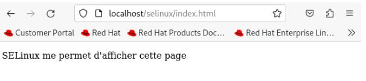

# Use Case 1: Web Page Configuration with SELinux on Red Hat 9

## Red Hat

- List users:
  ```bash
  cat /etc/passwd
  ```
   - Choose a user in this case selinux
- Create the directory /var/www/html/selinux:
  ```bash
  mkdir -p /var/www/html/selinux
  ```
- Change ownership of the directory:
  ```bash
  chown -R selinux:selinux /var/www/html/selinux
  ```
  - This command will recursively assign ownership of the directory /var/www/html/selinux to the user selinux and their group selinux. The -R flag means the command is recursive, affecting all files and subdirectories within /var/www/html/selinux.

- Create the file index.html:
  ```bash
  touch /var/www/html/selinux/index.html
  ```
- List the details with SELinux contexts:
  ```bash
  ls -alZ /var/www/html/selinux/
  ```
  - Interpretation of the output:
        - unconfined_u: The user is unconfined.
        - object_r: The context applies to the object (file index.html).
        - var_t: A generic type used for files in variable directories (like /var/www/html/), which is appropriate for web files.
        - s0: The security level, indicating the file has a default security level.
- List running processes with SELinux contexts:
  ```bash
  ps -Z
  ```
- List network connections and associated SELinux contexts:
  ```bash
  netstat -Zatunp
  ```

## Installing Apache Server and Accessing index.html:

- Install Apache server:
  ```bash
  sudo dnf install httpd
  ```
- Start Apache server:
  ```bash
  systemctl start httpd
  ```
- Check Apache server status:
  ```bash
  systemctl status httpd
  ```
- Access the page via http://localhost/selinux/index.html (it won't work)
- Resolve SELinux context issue:
  ```bash
  restorecon /var/www/html/selinux/index.html
  ```
  - This command restores the default SELinux context of the file. After this, you should be able to access index.html via Firefox.
    
  
- Create and move files:
  ```bash
  cp /var/www/html/selinux/index.html /tmp/selinux.html && mv /tmp/selinux.html /var/www/html/selinux/
  ```
- Verify that both files exist:
  ```bash
  ls /var/www/html/selinux
  ```
- List SELinux contexts:
  ```bash
  ls -alZ /var/www/html/selinux
  ```
- Access the new file via http://localhost/selinux/selinux.html.
  
  
- Access is denied, find the correct context:
  ```bash
  matchpathcon /var/www/html/selinux/selinux.html
  ```
### Method 1 : Restore default context

- restore default contextbash
  ```bash
  restorecon /var/www/html/selinux/selinux.html
  ```
- Access the page via Firefox again.
  
  
  
### Method 2 : Allow Apache to access files or directories located outside of the default location (/var/www) on the file system

#### Use chcon for a temporary change:
- Execute this command
  ```bash
  chcon -t httpd_sys_content_t /var/www/html/selinux/selinux.html
  ```
#### Use semanage for persistent changes:

- update system (instead of executing yum install -y policycoreutils-python)
  ```bash
  yum update
  ```
- Create a new directory and move files:
  ```bash
  mkdir /srv/web
  mv /var/www/html/selinux /srv/web/
  cd /var/www/html
  ln -s /srv/web/selinux
  ```
- List SELinux contexts:
  ```bash
  ls -alZ /srv/web
  ```
  
  
- Access the pages via http://localhost/selinux/selinux.html and http://localhost/selinux/index.html.
  
- If we reset contexts:
  ```bash
  restorecon -R -v /srv/web
  ```
  

- Define default context using semanage for dir srv:
  ```bash
  semanage fcontext -a -t httpd_sys_content_t '/srv/web(/.*)?'
  restorecon -R -v /srv/web
  
- The pages should now be accessible again.
  
  

# Use Case 1: Port Authorization

- Check the sshd service:
  ```bash
  systemctl status sshd
  ```
- Edit the sshd configuration:
  ```bash
  sudo nano /etc/ssh/sshd_config
  ```
- Add the line: Port 8888
- Update SELinux for the new port:
  ```bash
  sudo semanage port -a -t ssh_port_t -p tcp 8888
  ```
- Connect via the new port:
  ```bash
  ssh -p 8888 selinux@localhost
  ```
